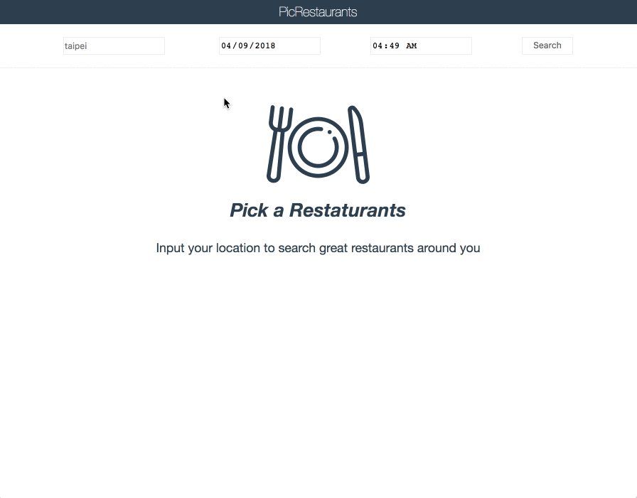

# PicRetaurants

## How to run
1. Install nodejs and yarn(optional).

2. Clone this repo and then navigate into the repo directory.

3. Run `npm install` or `yarn install`(if prefer and installed yarn).

4. Run `npm run start` or `yarn start`(if prefer and installed yarn).

5. Waiting the message `PicRestaurants app listening on localhost:3000!`

6. Open `localhost:3000` on the latest Chrome or Firefox

## How to build the client side assets
1. Install nodejs and yarn(optional).

2. Clone this repo and then navigate into the repo directory.

3. Run `npm install` or `yarn install`(if prefer and installed yarn).

4. Run `npm run build` or `yarn build`(if prefer and installed yarn).

5. The built js files, html files and images will be under the dist folder

## Explanations

#### Functionality
- The client side
  - Let user search 50 restaurants at most based on a location, date(optional) and time(optional)

  - Restautrants are sorted by opening/not-opening and ratings

  - Cache search results for this session

  - Handle the cases of loading and no result found

- The server side
  - Utilize Yelp's graphQL API to search restaurants

  - Accept the restaurant search requests from the client side

  - The API key is on the server side so will not be exposed to the client.

#### How did you decide the technologies you decided to use in your submission?
- Redux: the requirements ask for React. Redux is well-integrated into React ecosystem and is a great for the state management so go for Redux.

- Webpack: Weback is powerful for building and nicely integrated into React ecosystem so go for Webpack for the build settings.

- The node Express server[1]: the Yelp GraphQL dosen't allow "Access-Control-Allow-Origin" so we have to build a server to query data on our own. The reasons to chose the node.js and the Express are:

  1. Our client side is utilizing the node.js so quicker and simpler to continue with the node.js for the server developement.

  2. The Express APIs are eazy-understood and well-documented so go for it.

  [1] http://expressjs.com/

#### How did you decide the requests to Yelp API?
- What restaurant data to fetch: From a user's point, the following info may be what a user wants to know most:
  - Name: what is this restaurant called?
  - Phone: maybe I need a phone to make a reservation.
  - Address: where is this restaurant?
  - Photo: how does the food or restaurant looks like?
  - Rating: is this a delicious restaurant?
  - Business hour: is this restaurant in business?
  - URL: maybe I want to know more about this restaurant

- Rating is important on making a decision so go fetching data based on the rating. Let's collect top delicious restaurants and all their opening times from Yelp first. Then we can cache these restaurants and filter based on the input time. If we passed the time criterion to Yelp, our data would be bound to the time, as a result, once users change the time criterion we have to turn to Yelp again, which is bad for the network usage.

#### Are there any improvements you could make?
- More polished styles

- Take care of the case if no opening restaurants in the first returned 50 restaurants (though this may be a edge case)

- Add tests

- Design a more detailed routing rule

- Design the more detailed data transmission protocol between the server and the client

- Adopting the flow.js and/or immutable.js

#### What would you do differently if you were allocated more time?
- May not use the node Express but PHP, ROR etc. For the long run, the performance, maintenance and scalability are all important considerations to build a server.  

#### Consider time-zone differences
- Thanks to Yelp. It returns a restaurant's opening hours in the local time so we just filter the time based on user's input. Here we assume users would take the time zone factor while entering the time, such as, "13:00, London" means 13:00 in London local time. We don't setup a extra time zone flag on our UI and make the above assumption implicitly because any extra UI control could confuse users more.

#### Remember the most recent searched location
- We use the sessionStorage to cache recent search results. Why the sessionStorage is because we are not sure the update frequency of restaurants data in the 3rd-part Yelp. If we cached in the localStorage/indexedDB, we might save outdated data.

